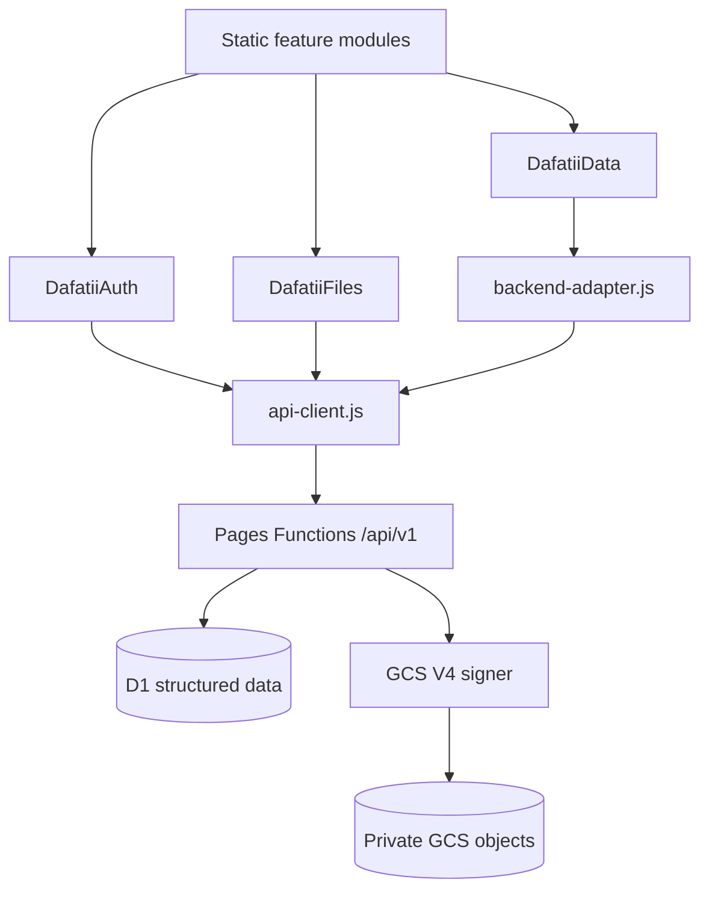
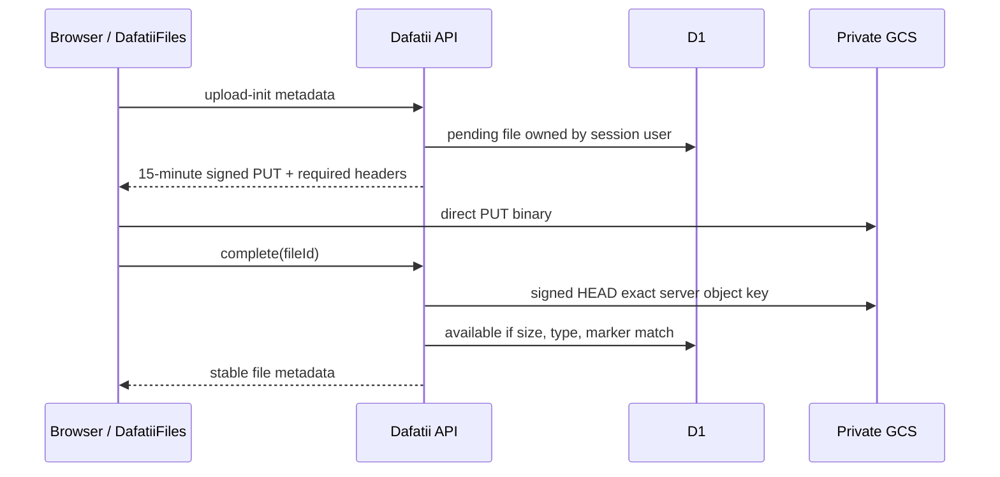
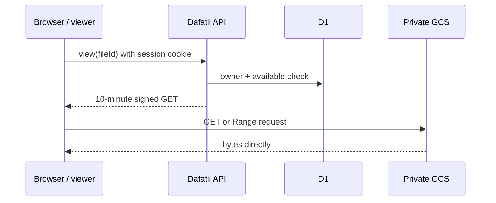

# Backend integration boundary

Dafatii's UI is intentionally independent of any backend framework or API shape. UI modules read and write through `window.DafatiiData`; `data-client.js` owns the browser cache and an optional remote adapter owns transport, authentication, retries, and server-specific DTO mapping.

## Runtime model

- Reads and edits remain synchronous and local-first, so the interface works while the network is slow or unavailable.
- A connected adapter receives every later synced-data write through `save(record)`.
- `load({ localRecords })` can reconcile existing browser data with server data and return the records that should hydrate the UI.
- Server hydration never overwrites a key with an unsent local write from the current session.
- `dafatii:theme` and `dafatii:direction` are device preferences and are intentionally not synchronized.
- The adapter is the policy boundary for authorization, validation, conflict resolution, retry/backoff, idempotency, and API-version translation.

This keeps UI markup, styles, navigation, and component behavior editable without changing backend code. Backend migrations only require updating the adapter as long as the record contract remains stable.

## Adapter contract

```js
const adapter = {
  async load({ localRecords }) {
    // Reconcile/migrate localRecords on the server if required.
    // Return an array, or { records: [...] }.
    return {
      records: [
        { key: 'dafatii:subjects', format: 'json', value: [], updatedAt: 1789000000000 },
        { key: 'dafatii:joined', format: 'string', value: '1', updatedAt: 1789000000000 }
      ]
    };
  },

  async save(record) {
    // record = { key, format, value, updatedAt };
    // deleted records also contain deleted: true.
  }
};

window.DafatiiData.connect(adapter).catch(error => {
  // The local UI remains usable. Report the error to observability here.
  console.error('Backend synchronization unavailable', error);
});
```

Load the backend adapter after `data-client.js` and before the feature scripts. Do not put tokens or secrets in client code; prefer secure, HttpOnly, SameSite cookies. Validate permissions and payloads on the server even if the UI already validates them.

## Conflict and reliability requirements

The generic client does not guess at cross-device conflict policy. The backend adapter should:

1. Give each authenticated user an isolated namespace.
2. Make saves idempotent (for example, by accepting a mutation ID or a monotonically increasing version).
3. Reject stale writes with an explicit conflict response rather than silently overwriting newer data.
4. Reconcile `localRecords` during first sign-in/import and return the authoritative records.
5. Retry transient failures with bounded exponential backoff and jitter; never retry authorization or validation failures.
6. Enforce request-size limits. Chat media should move to object storage and only durable metadata/URLs should use this record channel.
7. Emit structured telemetry for load latency, save latency, failed writes, conflicts, and pending mutations.

## Verification

Run `npm test`. The test uses only Node built-ins and verifies local reads/writes, device-only exclusions, remote hydration, event dispatch, and adapter saves.

## Production architecture

The original boundary above remains the governing rule. UI feature modules do not know API routes, D1 tables, Cloudflare bindings, GCS object names, IAM, or signed-URL details.



`dafatii:joined` is still a local presentation/onboarding flag. It is never accepted by the server as identity. Only a live server session establishes `user.id`, and every D1 query that touches private data includes that ID.

## Browser contracts

### `window.DafatiiAuth`

- `signup({email, password, displayName})`
- `login({email, password})`
- `current()` returns the authenticated user or `null`
- `logout()` revokes the server session and disconnects remote synchronization
- read-only `user` property contains the cached current user

Passwords are 12–256 characters. The server stores PBKDF2-HMAC-SHA-256 hashes with a random 128-bit salt and 600,000 iterations. Sessions use 256-bit random bearer tokens; only SHA-256 token hashes are stored in D1. Production cookies use the `__Host-` prefix, `HttpOnly`, `Secure`, `SameSite=Lax`, and `Path=/`. Unsafe API methods also require an allowed `Origin`, providing a second CSRF control. Login/signup attempts are rate-limited using a peppered IP/email fingerprint and generic login failures avoid account enumeration.

### `window.DafatiiFiles`

- `upload(file, { signal, onProgress })`
- `get(fileId)`
- `list({ limit })`
- `getViewUrl(fileId, { download })`
- `delete(fileId)`
- `open(fileId)` selects Dafatii's PDF, image, audio, video, or download UI

The browser only persists `fileId` relationships. `material-files.js` integrates this contract into each subject's Lectures area and stores subject relationships through `DafatiiData`. Storage-provider replacement therefore changes `file-client.js` and backend services, not feature components.

## Versioned API

All responses are JSON: `{ "ok": true, "data": ... }` or `{ "ok": false, "error": { "code", "message", "details"? } }`. Error codes are stable; messages are not an API contract.

| Method | Route | Purpose |
|---|---|---|
| POST | `/api/v1/auth/signup` | Create account and session |
| POST | `/api/v1/auth/login` | Authenticate and create session |
| GET | `/api/v1/auth/session` | Resolve current server session |
| POST | `/api/v1/auth/logout` | Revoke current session and clear cookie |
| POST | `/api/v1/sync/hydrate` | Import only absent local keys, then return authoritative records |
| POST | `/api/v1/sync/mutations` | Idempotent optimistic-concurrency mutation |
| POST | `/api/v1/files/upload-init` | Authorize metadata, create pending row, return signed PUT capability |
| POST | `/api/v1/files/{fileId}/complete` | Verify the exact object and idempotently publish it |
| GET | `/api/v1/files` | List the caller's non-deleted files |
| GET | `/api/v1/files/{fileId}` | Read caller-owned metadata |
| GET | `/api/v1/files/{fileId}/view` | Return a ten-minute signed GET URL |
| DELETE | `/api/v1/files/{fileId}` | Delete caller-owned storage object and tombstone metadata |

Authentication, validation, conflicts, and other permanent 4xx failures are not retried. Idempotent hydration, mutation, completion, and deletion calls retry only transient network/408/425/429/5xx failures with bounded exponential backoff and jitter.

## Data synchronization and migration

On first authenticated connection, `backend-adapter.js` sends the local snapshot to `sync/hydrate`. The server applies `INSERT OR IGNORE` within the authenticated user's namespace: local values fill absent keys but cannot overwrite existing server state. It then returns every authoritative server record with its revision. `DafatiiData` hydrates those values while protecting unsent writes from the current browser session.

Each later mutation contains a random UUID `mutationId` and `baseRevision`. D1 stores mutation results keyed by `(user_id, mutation_id)` for replay safety. Updates use `WHERE user_id = ? AND record_key = ? AND revision = ?`; a stale base returns `409 SYNC_CONFLICT` with the current record and is never silently overwritten. The adapter emits `dafatii:sync:conflict` for future UI resolution. Deletions are revisioned tombstones, preventing a stale device from resurrecting a deleted key.

Device-only `dafatii:theme` and `dafatii:direction` remain excluded. Imports accept at most 200 records, 1 MiB total request size, and 256 KiB per record. Import is non-destructive; do not remove local browser data until a separately reviewed retention/export policy exists.

## Upload and view sequences





Object keys are generated only as `users/{authenticatedUserId}/{randomFileId}/object`; filenames are display metadata, normalized and stripped of controls, slash, and backslash. A signed PUT binds the exact content length, validated content type, and `x-goog-meta-dafatii-file-id`, and carries `ifGenerationMatch=0` to prevent overwrite. Completion derives the key from D1 and requires exact size, MIME type, file marker, and known file signatures (PDF, common images, ZIP, Ogg, WAV, WebM, and MP4); mismatches enter `quarantined/rejected`. Duplicate completion returns the already-available object. Signed GET URLs last 600 seconds and are never stored or logged.

Interrupted single PUTs can be retried only by initializing a new file capability; GCS does not publish a partially completed simple PUT. Expired or abandoned rows remain recoverable `pending` records. A maintenance job should delete expired pending objects/rows only after checking both D1 status and exact object key; do not apply a bucket age rule to the shared `users/` prefix because that would delete available files. The schema's `quarantined` and `scan_status` fields are the hook for a later malware-scanning workflow. Until scanning exists, active HTML, XHTML, JavaScript, and SVG are rejected and unknown binaries download as untrusted attachments.

The same maintenance job should purge expired/revoked sessions, old rate-limit events, and `record_mutations` receipts after every supported client retry window (recommended: 30 days). Mutation receipt removal affects only very late replay semantics; record revisions remain authoritative.

The PDF viewer uses Mozilla PDF.js display APIs (pinned to stable `6.3.289`) and supports page navigation, page count, zoom, responsive fit, rotation, search, fullscreen, loading/error states, and authorized download. PDF.js and native image/audio/video elements issue Range requests directly to the signed GCS URL.

## D1 schema and migrations

`migrations/0001_production_backend.sql` creates:

- `users`: normalized unique email, password KDF, status, timestamps
- `sessions`: token hash, explicit user owner, expiry/revocation/last-seen timestamps
- `auth_attempts`: bounded-window abuse counters
- `records`: `(user_id, record_key)` primary key, tombstone, revision, timestamps
- `record_mutations`: per-user idempotency keys and saved responses
- `files`: owner, opaque key, safe display metadata, lifecycle state, generation, scan hook

Foreign keys, ownership indexes, unique object keys/token hashes, checks, and revision metadata are explicit. Apply migrations before deploying code:

```sh
npx wrangler d1 migrations apply dafatii-production --remote
```

For local development, copy `wrangler.example.jsonc` to `wrangler.jsonc`, replace only non-secret placeholders, create `.dev.vars` for secrets, apply migrations locally, then run:

```sh
npx wrangler d1 migrations apply dafatii-production --local
npx wrangler pages dev .
```

`.dev.vars`, `.env*`, service-account JSON, PEM/key files, Wrangler state, and dependencies are ignored. Never commit the copied service-account JSON.

## Cloudflare Pages configuration

Keep GitHub `main` as the Pages production source, build output at the repository root, and Functions at `/functions`. Create one D1 database and bind it as `DB` in both the intended production and preview environments. Cloudflare requires a redeploy after binding changes.

Set non-secret variables:

- `APP_ORIGINS`: comma-separated exact production/additional origins; the request's own origin is always accepted for same-origin previews
- `MAX_UPLOAD_BYTES`: default `536870912` (512 MiB), hard code ceiling 5 GiB
- `AUTH_ATTEMPT_LIMIT`: default `10` per 15-minute IP/email fingerprint
- `UPLOAD_INIT_LIMIT`: default `60` initialized uploads per authenticated account per hour
- `USER_STORAGE_QUOTA_BYTES`: default `10737418240` (10 GiB, including pending/quarantined objects)
- `GCS_PROJECT_ID`, `GCS_BUCKET`, `GCS_CLIENT_EMAIL`

Set encrypted secrets:

- `GCS_PRIVATE_KEY`: PKCS#8 service-account private key; escaped `\\n` or literal newlines are accepted
- `RATE_LIMIT_PEPPER`: independent random 32-byte value

The implementation uses browser-compatible WebCrypto and no Node Google SDK. The V4 signer follows Google XML API canonical URI, sorted RFC 3986 query, normalized/sorted signed headers, `UNSIGNED-PAYLOAD`, `GOOG4-RSA-SHA256`, credential scope, SHA-256 canonical hash, and RSA PKCS#1 v1.5 signature rules. Tests cryptographically verify the output signature and reserved/Unicode paths.

## Google Cloud setup

1. Create a dedicated regional or dual-region bucket appropriate to the user base. Enable uniform bucket-level access and enforced Public Access Prevention. Do not grant `allUsers` or `allAuthenticatedUsers`.
2. Create a dedicated service account. Prefer a custom bucket-scoped role containing only `storage.objects.create`, `storage.objects.get`, and `storage.objects.delete`. It does not need bucket administration. The signer must have the same object permission represented by each signed URL.
3. Create a service-account JSON key only if workload identity/IAM `signBlob` is not available to the Pages runtime. Store the email/private key as Cloudflare encrypted configuration, then securely delete the downloaded JSON. Rotate by adding a new secret, redeploying, validating, then revoking the old key; old signed URLs die no later than ten/fifteen minutes.
4. Apply `deploy/gcs-cors.example.json` after replacing every origin. Add exact active Pages preview origins; GCS CORS does not provide a safe wildcard-subdomain pattern, so do not use `*` merely for previews.

Example commands (require an authenticated Google Cloud CLI and correct project):

```sh
gcloud storage buckets create gs://BUCKET --project=PROJECT --location=REGION --uniform-bucket-level-access --public-access-prevention=enforced
gcloud storage buckets update gs://BUCKET --cors-file=deploy/gcs-cors.example.json
gcloud storage buckets add-iam-policy-binding gs://BUCKET --member=serviceAccount:SERVICE_ACCOUNT --role=projects/PROJECT/roles/dafatiiObjectSigner
```

CORS permits exact origins and only GET/HEAD/PUT, including headers needed for signed metadata and Range media access. DELETE and verification are server-to-GCS operations and do not need browser CORS. Keep object versioning off initially unless recovery requirements justify its storage cost; soft delete/default retention and versioning settings must be included in the cost model before enabling.

## Security and observability

All file reads/deletes query `(id, authenticated user_id)` and return the same 404 for missing or foreign objects, preventing IDOR discovery. Client-supplied owners and object paths do not exist in the contract. API responses use no-store, nosniff, no-referrer, and deny framing/default content. Display names and filenames are length-bounded and filenames cannot traverse paths. Sensitive operations emit one-line structured JSON events for auth failures, hydration, conflicts, upload initialization/completion, signing failures, and deletion failures. The logger removes fields whose names resemble passwords, tokens, private keys, secrets, or signed URLs.

Route logs should be retained with access restricted to operators. Alert on sustained `auth.login_failed`, any `gcs.signing_failed`, elevated `sync.conflict`, `file.deletion_failed`, D1 errors, and 5xx rates. Never enable request logging that captures query strings on signed GCS URLs.

## Failure recovery

| Failure | Durable state | Recovery |
|---|---|---|
| Upload interrupted | `pending`; no partial simple-PUT object | Re-init and upload; later cleanup expired row/key |
| URL expired | D1 row unchanged | Request a new view URL; if the upload already landed, completion may still verify it, otherwise re-init |
| Duplicate mutation/complete | mutation response or `available` | Return prior result without rewriting |
| Sync conflict | newer revision retained | Surface conflict; hydrate/resolve explicitly |
| Object missing at completion | `pending` | Retry upload while capability lives or re-init |
| GCS delete fails | `delete_failed` | Retry DELETE; generation precondition prevents wrong-object deletion |
| D1 unavailable | local UI remains usable, remote action fails | Retry transient idempotent operation after service recovery |
| Session expires/revoked | local cache remains; server rejects | Re-authenticate, then hydrate/reconcile |
| DB says available but object missing | metadata retained for diagnosis | mark/quarantine through an operator repair procedure; restore object or tombstone |

Rollback frontend/Functions by reverting the PR or selecting the prior Pages deployment. Do not roll back an applied migration destructively. This initial migration is additive; later migrations must be forward-compatible for at least one deployment window and include an explicit compensating migration when rollback is required.

## Backup, restore, quotas, and cost

Before migrations, export D1 with Wrangler's current supported export command and verify the SQL artifact can create a fresh staging database. Periodically inventory GCS objects and compare `(object_key, generation, size)` to available D1 rows. Restores must preserve user IDs, file IDs, object keys, and generations together; restoring only D1 or only GCS can create dangling references. Test restore in an isolated project/bucket, never against production first.

Primary costs are D1 reads/writes/storage, Pages Function invocations/CPU, GCS stored GiB-month, operations, and GCS internet egress. Binary bytes bypass Pages Functions in both directions, so Functions process only small JSON, signing, and HEAD/DELETE control requests. PBKDF2 login CPU and abusive upload initialization are bounded by the auth limiter and server validation. Monitor quotas rather than assuming any free tier is permanent. At scale, introduce Turnstile or edge rate limiting, resumable-upload session support, asynchronous scanning, and a scheduled reconciliation worker without changing `DafatiiData` or `DafatiiFiles`.

## Deployment checklist

1. Run `npm test` and `npm run check`.
2. Create/apply D1 migration and configure `DB` for preview first.
3. Create the private GCS bucket, least-privilege signer, CORS, and encrypted settings.
4. Deploy the branch preview; test signup/login/logout, two-account IDOR cases, sync conflict, PDF/media Range playback, upload expiry, and deletion retry.
5. Inspect structured logs and verify no signed URL query strings or credentials appear.
6. Merge only after review/authorization. Pages then deploys `main` using the existing GitHub integration.
7. Roll back application code with the prior Pages deployment if necessary; preserve the additive schema and uploaded objects.

Authoritative references used for the runtime-specific design: [Cloudflare Pages bindings](https://developers.cloudflare.com/pages/functions/bindings/), [Google V4 signing algorithm](https://cloud.google.com/storage/docs/access-control/signing-urls-manually), [Google signed URL security model](https://cloud.google.com/storage/docs/access-control/signed-urls), [Google Cloud Storage CORS](https://cloud.google.com/storage/docs/cross-origin), and [Mozilla PDF.js](https://mozilla.github.io/pdf.js/getting_started/).
