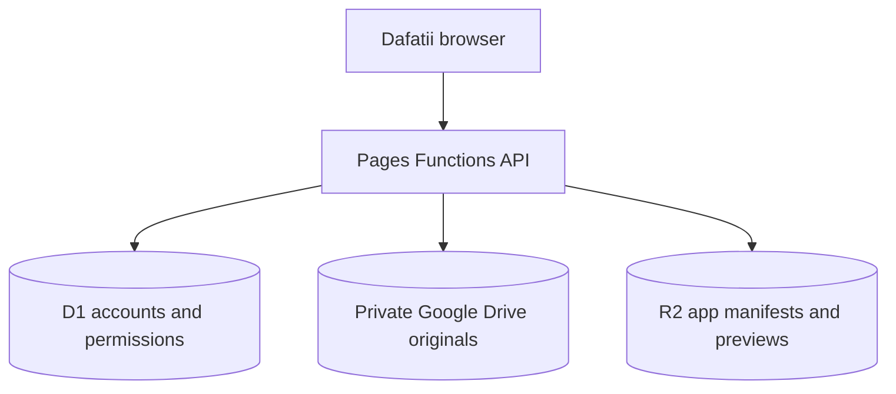

# Dafatii backend and storage

Dafatii uses a local-first browser interface with a real Cloudflare backend. UI modules read and write through `window.DafatiiData`; authentication, synchronization and files use the versioned `/api/v1` Pages Functions API. Server sessions use secure HttpOnly cookies, and every course or file action is authorized from D1.

## Hybrid storage model

| Data | Service | Purpose |
|---|---|---|
| Accounts, sessions, courses, enrollment, roles and permissions | Cloudflare D1 | Relational and authorization data |
| User-uploaded originals | Owner's private Google Drive | Files, images, audio, video, PDF, Word, Excel, PowerPoint and archives |
| App-owned manifests and future generated previews/thumbnails | Cloudflare R2 (`R2_STORAGE`) | Durable object storage controlled by Dafatii |
| API and authorization | Cloudflare Pages Functions | Validates sessions, permissions, uploads, reads and deletion |

R2 is object storage, so it does not replace D1 for accounts or course relationships. The browser never receives the Drive OAuth refresh token or client secret. It receives only a resumable upload session created for one validated file. Reads pass through an authenticated Dafatii content route, so Google Drive's viewer is never used.

Existing GCS objects remain readable and deletable. Set `STORAGE_PROVIDER=drive` for every new upload to use Google Drive.

## Browser contracts and viewers

`window.DafatiiAuth` exposes `signup`, `login`, `current`, and `logout`. Passwords are hashed server-side, sessions are stored in D1, and production cookies use the `__Host-` prefix with `HttpOnly`, `Secure`, `SameSite=Lax`, and `Path=/`.

`window.DafatiiFiles` exposes `upload`, `get`, `list`, `getViewUrl`, `delete`, and `open`. The built-in viewer renders PDFs with PDF.js, images, audio and video with native browser controls, text and CSV inside Dafatii, and Excel workbooks as an in-site table. Other formats receive a consistent Dafatii file screen and authorized download; no Google Drive reader is embedded.

## File lifecycle

1. The signed-in browser sends safe metadata to `POST /api/v1/files/upload-init`.
2. The API validates course permissions, MIME type, size, quota and rate limits, then creates a pending D1 row.
3. The API uses the server-only Google refresh token to create a resumable Drive upload session inside `GOOGLE_DRIVE_FOLDER_ID`.
4. The browser uploads the bytes directly to that session and sends the resulting Drive file ID to `POST /api/v1/files/{id}/complete`.
5. The API verifies size, MIME type, folder, Dafatii ownership properties and known magic bytes before publishing the file.
6. The API writes a non-secret manifest to `R2_STORAGE` at `files/{dafatiiFileId}/manifest.json`.
7. Authorized viewers read `/api/v1/files/{id}/content`; Pages Functions checks D1 access and streams Drive bytes with Range support.

Drive identifiers are server metadata only. Dafatii stores stable UUID relationships in the browser. Active HTML, XHTML, JavaScript and SVG uploads are rejected. Known mismatches are quarantined.

## File API

| Method | Route | Purpose |
|---|---|---|
| POST | `/api/v1/files/upload-init` | Start an authorized Drive upload |
| POST | `/api/v1/files/{id}/complete` | Verify and publish the upload |
| GET | `/api/v1/files` | List accessible file metadata |
| GET | `/api/v1/files/{id}` | Read metadata |
| GET | `/api/v1/files/{id}/view` | Return a Dafatii viewer/download URL |
| GET | `/api/v1/files/{id}/content` | Stream authorized Drive content |
| DELETE | `/api/v1/files/{id}` | Delete the Drive original, R2 manifest and metadata |

## Cloudflare configuration

Apply `migrations/0001_production_backend.sql` and `migrations/0002_course_rbac.sql` to the same D1 database, then bind it as `DB` in both Preview and Production. No new migration is required for Drive because the existing opaque `object_key` stores provider-qualified identifiers.

Create a private R2 bucket such as `dafatii-app-storage` and bind it to the Pages project as `R2_STORAGE`. Do not expose a public bucket URL.

Set these plaintext variables in both environments:

- `STORAGE_PROVIDER=drive`
- `GOOGLE_DRIVE_FOLDER_ID`
- `APP_ORIGINS`
- `ADMIN_EMAILS`
- `MAX_UPLOAD_BYTES` (default 512 MiB)
- `AUTH_ATTEMPT_LIMIT`, `UPLOAD_INIT_LIMIT`, `USER_STORAGE_QUOTA_BYTES`

Set these as encrypted secrets:

- `GOOGLE_DRIVE_CLIENT_ID`
- `GOOGLE_DRIVE_CLIENT_SECRET`
- `GOOGLE_DRIVE_REFRESH_TOKEN`
- `RATE_LIMIT_PEPPER`

Keep legacy `GCS_BUCKET`, `GCS_CLIENT_EMAIL` and `GCS_PRIVATE_KEY` while old GCS files still exist. Redeploy after bindings or variables change.

## Google Drive setup

1. In Google Cloud Console, create or select the project used for Dafatii and enable **Google Drive API**.
2. Configure the OAuth consent screen. While the app is in testing, add the Google account that owns the storage folder as a test user.
3. Create an OAuth 2.0 Web client. Add `https://developers.google.com/oauthplayground` as an authorized redirect URI.
4. In that Google account's Drive, create a private `Dafatii uploads` folder and copy the folder ID from its URL.
5. Open OAuth 2.0 Playground, enable **Use your own OAuth credentials**, enter the client ID and secret, authorize the Drive scope, exchange the authorization code, and copy the refresh token.
6. Put the client ID, client secret and refresh token into Cloudflare encrypted secrets. Put the folder ID into a plaintext variable.

Use a dedicated Google account for storage when the site becomes public. Google account storage limits still apply, so monitor usage and keep recovery exports.

## Security and recovery

Personal files require ownership. Course files require an active course membership; deletion also requires the content-removal advantage. Missing and unauthorized files both return 404 to prevent identifier discovery. User filenames never become object paths. Logs omit tokens, secrets and upload URLs.

Back up D1 before migrations and periodically reconcile available D1 file rows with Drive app properties and R2 manifests. If either provider deletion fails, D1 records `delete_failed` so the operation can be retried.

Run `npm test` and `npm run check` before deployment.
